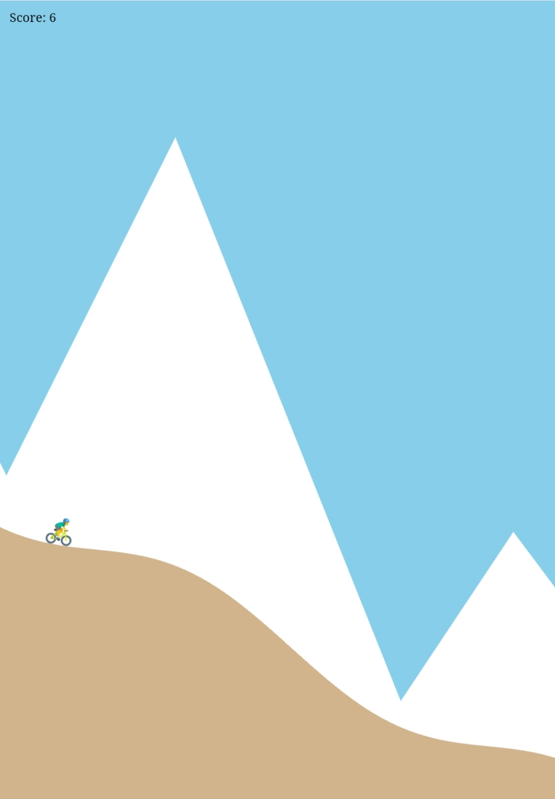

<h1><a href="https://bacionejs.github.com/bike/" style="text-decoration: none; color: inherit;">Play</a></h1>

Bike game is a side-scrolling stunt cycling game where you jump, flip, and avoid obstacles to score points.

## 🎮 How to Play

- **Jump:** Long-press
- **Scoring:**  
  - Passing a cat successfully increases your score.  
  - Hitting a cat or failing to ace the landing decreases your score.

